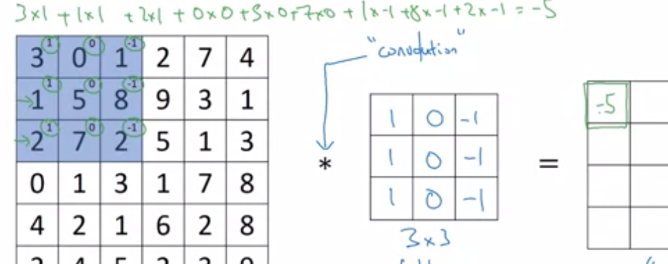
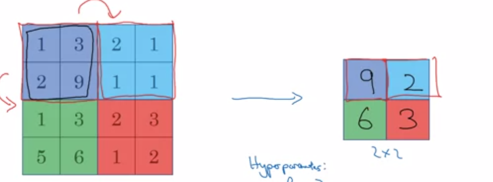
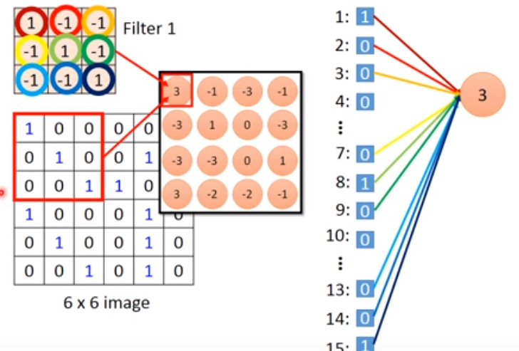
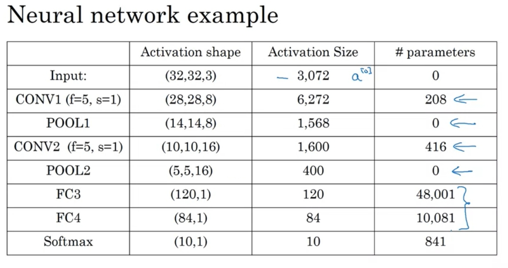
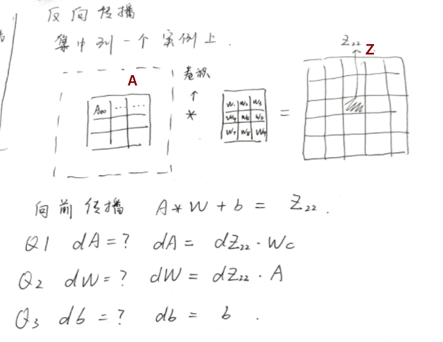
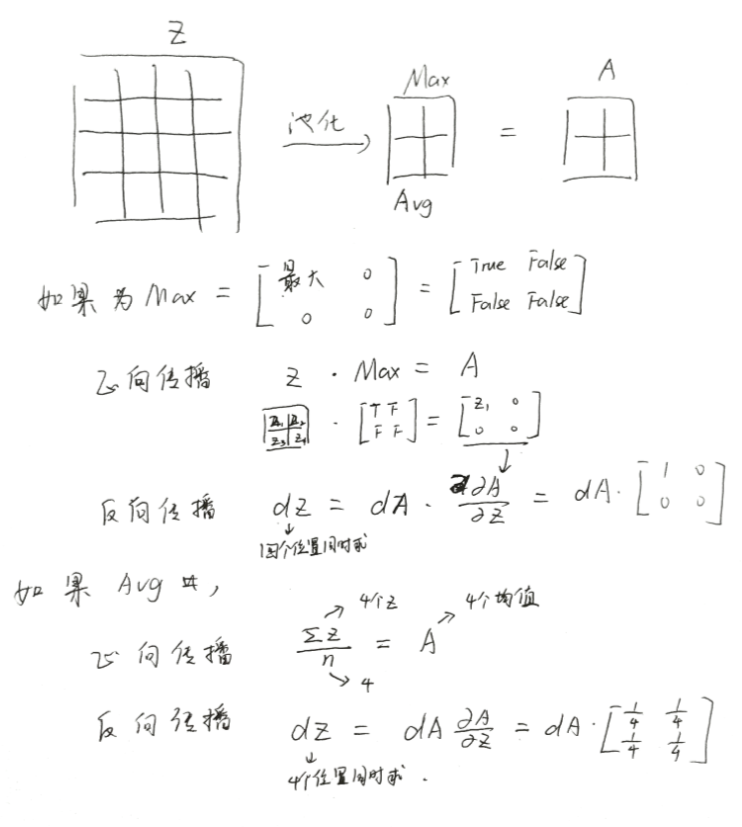
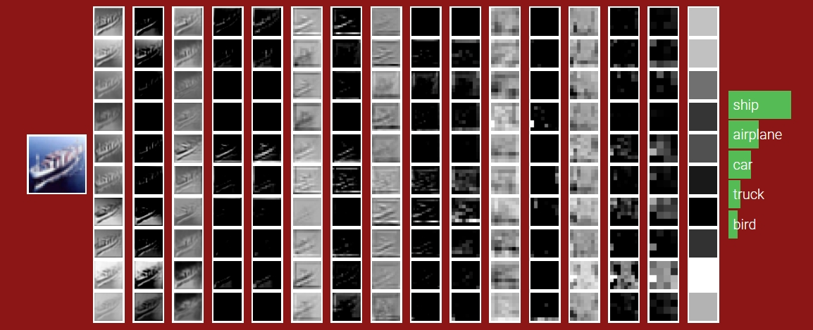

# 卷积神经网络

## 1  摘要
本篇主要是卷积神经网络，从DNN遇到的问题开始，简单介绍卷积神经网络的基本模型，然后深入分析两个重要过程：卷积和池化，以及分析卷积神经网络的优点，再就是卷积神经网络中卷积和池化的方向传导的理解和推导过程。

- CNN概述
- 卷积、池化
- CNN反向传播推导

## 2  DNN深度学习的问题
传统深度神经网络模型是有问题的，在上一周做手势识别就可以看出，图片为64x64 px，已经有12888个特征的，如果首层是相同数量级，那么复杂度已经达到了千万级别——梯度下降再厉害，也架不住这种增长。

其实仔细分析可以知道，我们把所有像素点做特征，从零开始让模型自己找特征其实是无奈之举，图片里很多很多区别根本就没有意义，这意味着有大量的无用特征以及大量的无用权重。计算动不动千百万级别个变量的函数最值，即使梯度下降已经如此厉害，仍然无法在不至于太大的迭代中收敛，根本来不及收敛。

所以，传统DNN的问题在于，如何减少无用特征以及权重。

## 3  CNN简介
卷积神经网络并不复杂，从模型上说其实比DNN还要简单。以CNN的最初发明场景，计算机视觉，物体识别为例，原因是，CNN不再以像素而改成边缘的小线段。想象一下，输入所有像素，必定会在高层找到这些轮廓线段，那如果能直接输入轮廓线段，那完全没必要输入所有像素点。

CNN使用卷积和池化来捕获边缘，如果看过数字图像处理，那就非常好理解，实际上捕获边缘的方式就是使用的滤波器。可以先不用管卷积和池化是什么，反正是用来检测边缘的两个概念。

整体上，CNN的结构是这样的：

X –>  卷积  -->  池化 –-> 卷积 -->  池化  –> …… –> DNN(全连接神经网络)

可以看到，就是在输入DNN前先用卷积+池化找到类型小线段的特征。

## 4  CNN原理
严肃的知识并不能一直用通俗的语言来表达，很多公式，概念本身信息量就是通俗语言难以简洁有趣地表达出来。以下是CNN中的重要组成概念，卷积和池化。

### 4.1  卷积

卷积是怎么回事，如图，左边是像素点，中间是卷积核（滤波器），选中区域和滤波器内积就等于-5，这就是卷积过程。

**Filter捕获边缘的原理**

为什么这种内积可以捕获边缘呢？想象一下，如果滤波器是处在像素之中，那么左右两行的内积就会相互抵消，说明在图形中是没输出的，只有当一边有象数一遍没有像素的情况下，内积才会输出一个绝对值比较大的值，这也就是检测的边缘。

**输出层size的计算**

n为输入层的边长，p是padding宽度（这是为了使得边缘值计算的公平性，给边缘加上的一层哨兵层，细节问题，具体就不讲了），f为滤波器边长，s为滤波器移动的步长。

### 4.2  池化
池化实际上也是Filter，只不过它不再是捕获边缘，而是要让边缘信息放大，进一步缩小图片尺寸。

右边是卷积的输出，最大值池化就是在左侧不同颜色块中找到最大的，保留下来。非常简单，均值池化，就是求色块的均值。

### 4.3  分析
CNN有很多有意思的特点，这些特点使得CNN的效率变得非常高。

**一、权重共用**

原来是1个特征1个权重，现在只有滤波器上有常数个权重，也就是，不管你输入怎么变化，我权重数量只和滤波器数量有关。这是因为一个滤波器上的权重，几乎所有点都公用，也就是发送权重共用，使得权重不再随着输入变化而线性变化。

你可能觉得很奇怪，为什么权重能公用，这样有效果吗？其实有效果的原因是从宏观上来看，一个滤波器检测的是一种边缘，比如一段小直线，而这样的直线，在整张图中都是差不多的。所以权重公用，宏观表现应该是特征共用。

**二、稀疏的连线**

原来每个特征和每个神经元之间都会有一条连线，也就是所谓全连接。但CNN则不同，如果将滤波器张开成一维数组，那么可以看到，连线变得非常稀疏。如图中，最终输出的4x4=16个单元，按道理全连接网络中，每个单元应该来自所有像素点，但CNN中每个单元只来自于9个输入点，如右图。所以会使得连线变得非常稀疏。

宏观上来看，事实上，输出这个单元大部分和输入的9个点相关，其他点都是无关的，所以有连线都是无用连线无用权重。

由于以上两点，使得这样的识别系统发生严重过拟合的现象得到极大的缓解——特征不再那么多，权重也大幅度降低，无用权重大部分都没了，有用权重大部分都被留下来。

**三、平移不变**

之前增加数据量的时候我们做过一件事，就是通过将图片水平翻转、一种视角等等变化，作为新数据放入数据集中以增加数据。这说明，以前，已经得到的特征是固定位置的，移动后模型就不认识了。而CNN中，边缘线段作为基础单元，却有非常好的可平移的性质，也就是说，物体在图片中的不同位置这件事，对于这些边缘来说，都是一样的。

**四、小结**

基于以上几个特点，CNN模型是非常高效的，你很难想象它对于权重这件事的效率提升。比如，一个全连接的网络，32x32x3的输入中，仅仅第一层的权重，可能就十万到百万级别。而对于CNN，如图

前面层次，几乎几百个权重就能解决问题。

## 5  CNN反向传播的理解和推导
反向传播新增内容主要在于卷积的反向和池化的反向两部分。其实因为向前传播时卷积和池化使用的就是很简单的计算，所以并不会很复杂。

但是真正要严格表述出来，大量的下标上标，会非常劝退。所以下面尽量不用这些表示方法。

为了理解这两个过程，请注意将视角固定在一次滤波操作上，而不要关注多个滤波操作的叠加结果。

### 5.1  卷积反向传播
公式其实很简单，是这样的。

A为前一层的输出，A经过卷积得到Z

A到Z的过程中，使用了权重W和偏移b，也就是滤波器上的权重。

先不管+=符号，关注一次滤波操作。

图中的A，Z，b都认为是这次滤波涉及得到的数据。

由于最终结果是多次滤波的叠加，叠加求和的导数也是叠加求和，因此，最开始的公式才会用上+=符号。

### 5.2  池化的反向传播
同样，只关注一次池化操作，图中所有字母都认为是这次操作的数据。

所以池化的反向传播，最终公式如下二者之一，同上，也是叠加。

上面一条是Max池化，下面是均值池化，f是滤波器边长。

## 6  小结-关于CNN的思考

1. 最初学完CNN之后，真的是觉得非常奇妙。一直以来就有一种模糊的感觉——识别物体可以通过物体的轮廓，大致颜色等等来识别吗？轮廓该如何表示？CNN完美地契合了各种要求，这的是太厉害了。
2. 从宏观的角度来看CNN，我们做的事，输入一些线段，然后让损失函数和梯度下降给我们组合出各种各样的特征、模式。
3. 如上，感觉对神经网络的模型的理解又深入了一步——本质上普通深度神经网络也是这样的，输入所有像素点，让模型帮我们找出特征。我感觉，神经网络模型的思考方式，简直是现代计算机的结晶。、
4. CNN为启发，其他领域模型的简化特征、量化和向模型描述特征的方式又是什么？

## 7  练习
1. 搭建CNN，包括了正向传播和反向传播，使用numpy实现
2. 搭建CNN，使用tensorflow，做的是上周的手势识别小demo