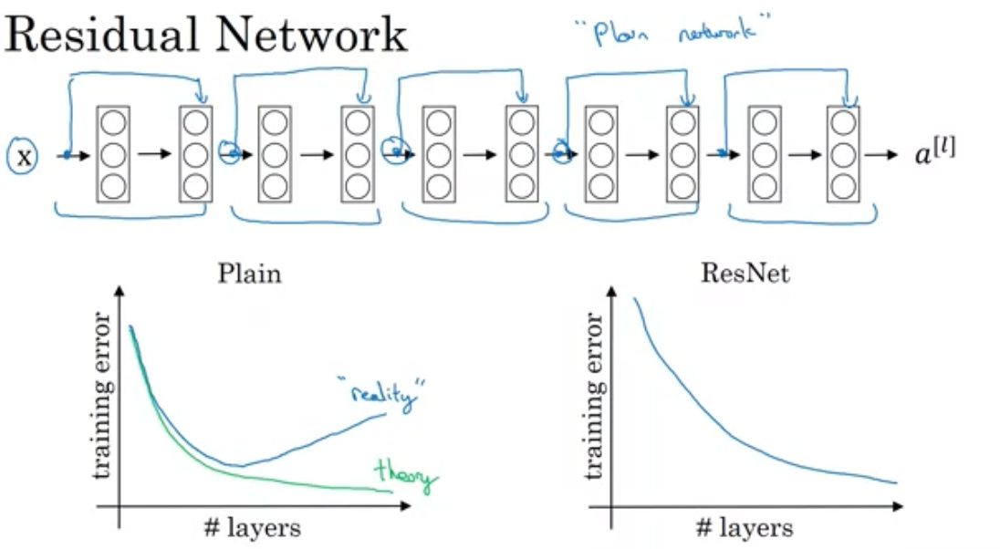
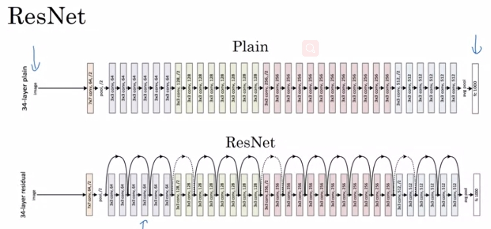
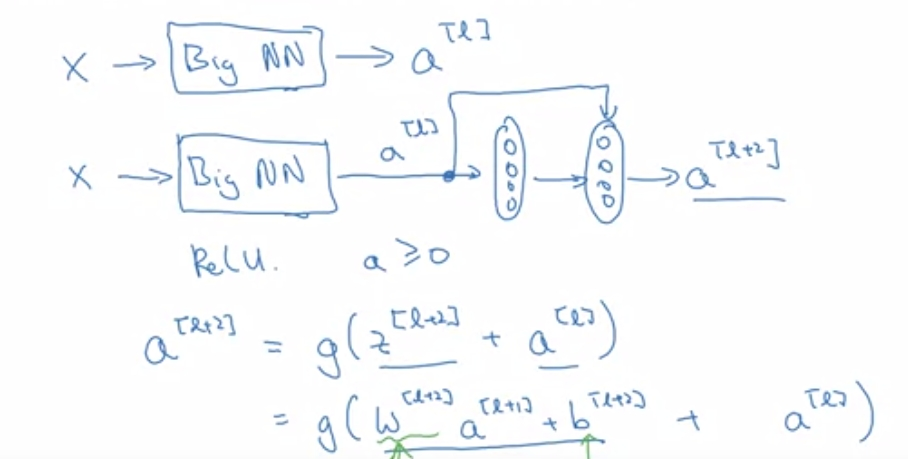
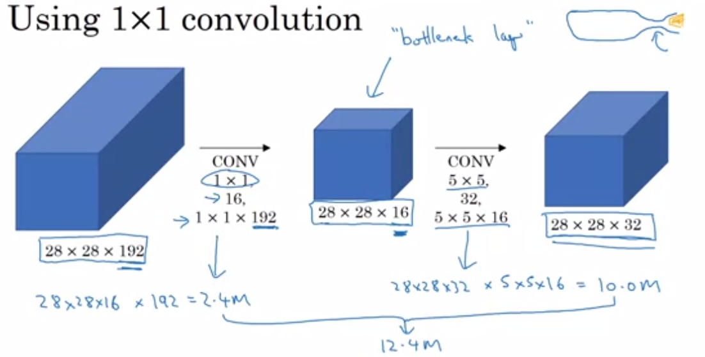
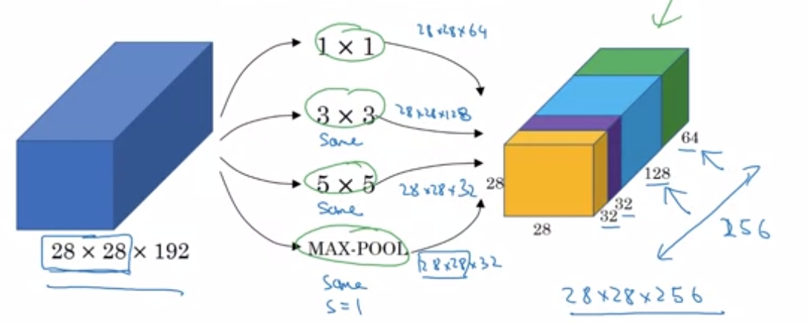
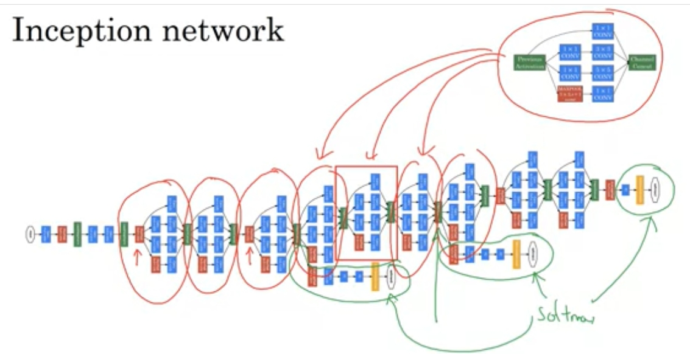

# 高级卷积神经网路

## 1  摘要
本文主要讲讲更加复杂的卷积神经网络，ResNets（残差神经网络）以及Inception（GoogleNets）。复杂的结构都是由一个个块组成的，学习每个块并不复杂。

第二个内容是一些实践建议，比如迁移学习、拥抱开源、数据增广、人工设计特征、集成学习对比赛的改进。

- ResNets
- GoogleNets、Inception、1 x 1 convolution
- 迁移学习

## 2  ResNets
> 神经网络模型是不是越深越好？
>
> 答：不是的。尽管容易认为更加复杂的网络能够拟合更加复杂的函数，但其实实践上并非如此，表现如图。
>
> 
>
> 为什么？原因有二。
>
> 1. Gradient  vanish（梯度弥散），和以前Batch normalization的使用原因一样，太深的网络，会导致权重指数级别减少或者指数爆炸增长。使得梯度下降很慢或太快，导致损失反而增加。
> 2. 退化问题。假定5层的网络对于一个问题来说已经被你调到了最优状态，此时的问题是，是否增加几层，会比现在更好？——不是的。

残差神经网络基于上述问题，构建了一个非常特别的网络结构。

### 2.1  模型


就是在某些局部，增加一些“捷径”。这就是残差神经网络的基本结构。不用觉得复杂，事实上，它只是残差块的多次重复而已。让我们关注其中一个小块。

### 2.2  原理


上述公式，正是捷径做的事。

问题是，为什么增加捷径就有用？

一般来讲，如上面所说的退化问题——不一定层次越多越有用，一些层次效果不好，有时候我们希望它们什么都不做，让输出等于输入。捷径的增加，使得这件事变得很容易。

那为什么增加捷径会让这件事变得容易？

观察最后一条公式，如果没有捷径增加的a项，我们想让它不变的唯一方式是，尽可能让W为1（忽略b）。但这件事梯度下降很难做，因为一般来说W我们初始化非常小。而如果我们增加了最后的a项，那么，我们想让它不变的方式就是让W为0，这显然容易很多。

另外，增加捷径之后可以视为加速无效了很多无用层次，同时也使得参数变少，使得梯度下降更好做。

## 3  GoogleNets
> 问题：我们什么时候该用（1，1）、（3，3）、（5，5）的Filters，又该不该加一个Pooling？
>
> Google： 为什么不考虑全用用看。

以下是Inception也就是GoogleNets被创造的原因——一个使用掺杂多种配置的网络。

这个的模型有点复杂，工程上。要理解它，先关注它的一个block。但理解它的block之前，又得先理解1 x 1卷积——这是一个有趣的操作。

### 3.1  1x1卷积
简单来说，这是用来改变输入的体积（具体来说是高）。



上图，可以发现，两次1x1卷积的效果——长宽不变，高被改变。

**事实上，我认为，理解好卷积神经网络的一个关键，就是熟悉卷积之后volume的改变。池化改变长宽，卷积改变长宽高**

尤其是1x1卷积，非常好的特性是只改变高。而且更有趣的是，甚至可以减少计算量，如上图，原来需要计算120M次，使用1x1卷积之后，变成12.4M次。可以慢慢推推看，不难算。

### 3.2  Inception Block
理解这东西的前提是，对卷积长宽高的改变非常熟悉！



可以看到，GoogleNets的块，基本就是使用不同大小的卷积核同时对输入进行卷积，然后保持长宽一致，合并在一起。

### 3.3  整体模型


最终便形成了看起来非常恐怖的一个神经网络结构。但是这是工程上的复杂，其实原理上反而很简单，就是多种配置的合成。而且它会在隐藏层中设置多个输出，据说能起到正则的效果——反正这个我不理解。

## 4  实践建议
### 4.1  迁移学习
非常常用的技术。指的是，不从头开始训练，而是转而从已有项目，别人训练好的模型入手。主要的好处，一个是不必再重新训练巨量数据，可以用已经训练的数据做预训练数据，二是一定程度上，缓解数据不足，相似任务一些特征可以迁移。

- 冻结隐藏层，只改变输出层
- 冻结一部分隐藏层后面连上自己的神经网络
- 直接使用模型，重新训练数据

### 4.2  其他
**a、使用开源代码**

看论文实现并不是一件容易事，比如说上面的GoogleNets，就非常复杂。深度学习者一般倾向把代码开源，这是一件很好的事。从别人的项目开始，这是相当节省时间和精力的方法。

**b、数据增广**，介绍了一些书增广的方法。

**c、数据少那么人工设计**

数据很多的领域，比如说语音识别，一般就完全不需要太多人工设计，但数据少的领域，人工设计就特别重要。比如说计算机视觉的很多领域，就算是图形识别领域，数据量也是远远不够的。这也就是会卷积神经网络会出现那么多的网络结构的原因所在。很多时候人工设计绝不是一件简单的事。

**d、集成学习提高性能**，这个主要是针对比赛的建议，利用多模型求平均之类的提高百分之一点点的准确率——尽管小，有时候就是胜负的关键。

## 5  练习
**keras的使用**

比tensorflow更加高等级的抽象，可以适用于快速原型，练习的内容是使用keras轻松搭建卷积神经网络的模型。

还记得上一周用tensorflow手写了卷积和池化的算法，非常麻烦。keras用起来就很快。可能不是很灵活。

**残差神经网络**

搭建了50层的残差神经网络，搭建这么深的神经网络的方法是，数层封装成块，重复组合各种块，以此来搭建。

1. 首先的恒等块的搭建，通过filters传入滤波器的个数，最终成为卷积块的高。
2. 然后是卷积块的搭建，于恒等块的区别在于，它会通过strides调整块的长宽
3. model建立，重复以上的基本块，构建模型

PS. 为了维护，关注一下层次的命名规则

`res4d_branch2a`

表示的是残差捷径第4个状态，第d次调用，第a个节点

以下两个可视化功能非常有用。

````python
model.summary()
plot_model(model, to_file='model.png')
SVG(model_to_dot(model).create(prog='dot', format='svg'))
````

