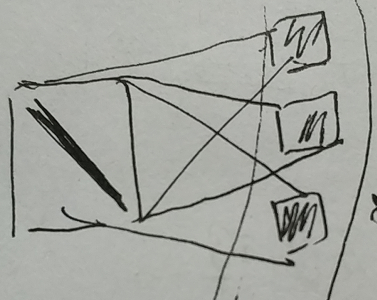
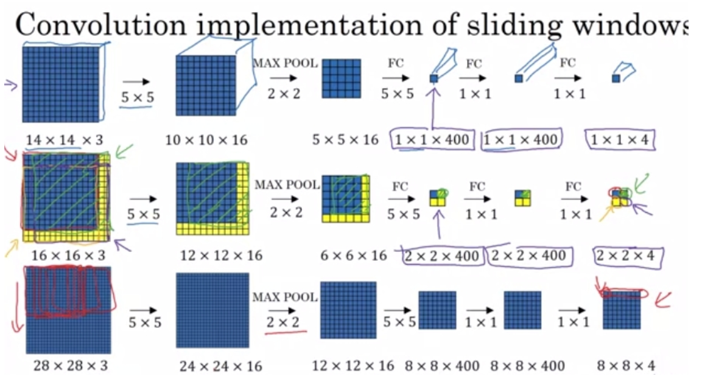
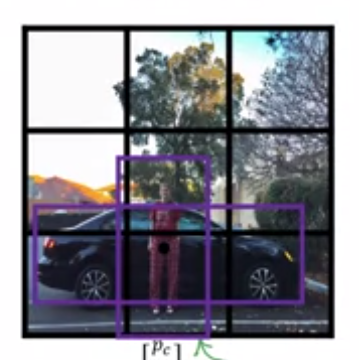
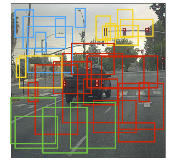
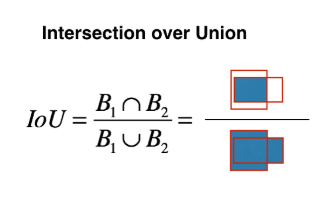
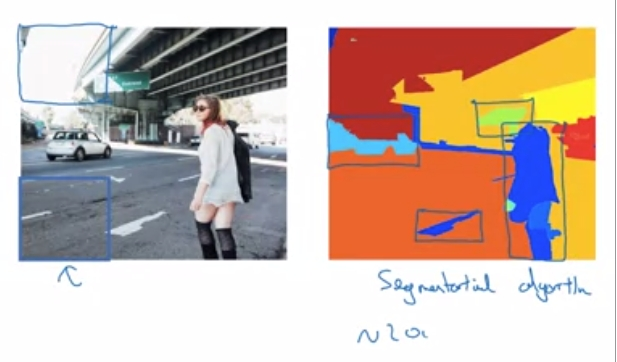

# 用于目标检测的YOLO和R-CNN

## 1  摘要
本文讲cnn应用于目标检测，主要是两种网络，YOLO和R-CNN。重点在于YOLO，通过YOLO进一步理解卷积操作的神奇和强大。另外就是cnn在目标检测的应用的一系列很有意义的方法，比如，如何预测绑定框、多目标重叠如何处理、如何合并多个选框，不同选框之间如何量化相关性，

其次，目标检测的传统思路。

再者，我认为相当重要的是，拿到一个训练好的模型，如何使用？这一点在练习中得以体现。

- 目标检测，Sliding window（滑动窗口）
- YOLO，Anchor Box（多目标技术），Intersection Over Union（boxes相关度），nonmax-suppression（非最大抑制）
- R-CNN

## 2  目标检测
讲以下网络之间，必须先理解目标检测算法。目的就是找到图片中的目标，识别它，并且框出它的所在。

最粗暴的想法是，如果能在图片中分别识别所有可能的窗口（包括大小和位置），那就能够完成这件事。但很明显，这样太傻了，不可能做到。于是就引入了**滑动窗口**。

基本思路是：

利用滑动窗口，设定窗口的有限大小，设定每次移动的有限步数，简化上述所有窗口的想法，然后对每个窗口进行检测。

看起来也不怎么样。但其实，在传统方法中，一般预测都是线性的函数，所以即使是滑动窗口有点多，也可以很快做到。但传统方法不太擅长识别物体这件事。于是有了YOLO。

## 3  YOLO
### 3.1  简述YOLO
YOLO是一个挺难理解的算法，原因是需要理解的概念非常多。先整体上把握一下YOLO干的事：

>  YOLO利用卷积和resize将图片变成19x19的网格，每个cell都对cell中的目标进行预测，包括是否存在、类别、位置信息，然后通过筛选、融合预测的信息，最终得到结果。（为了方便，下面都用19x19的特例来说明）


如上图，请仔细看途中批注部分，每个点都是下面要讲到的概念。YOLO的整体就是上图，然后复杂基本都是来自于这些概念，下面会一个一个讲。

我想，理解YOLO主要理解两个问题：

1. 如何通过卷积来实现滑动窗口类似操作并且同时实现了预测？
2. 19x19个预测信息如何筛选以及整合？

### 3.2  预测目标设计
<div align=center></div>
预测目标，不再局限于类别，现在引入了更多信息——没错，这对CNN来说只是提供的训练的数据的差别而已，尽管对我们来说很难接受。总之：

- p：目标是否存在
- x，y，h，w：位置信息，左上角坐标和宽高。
- c：什么分类

值得一提的是，多分类问题我们只能使用Log类型的损失，而向前面p，x，y，h，w这几项都可以直接使用平方损失来计算。具体损失函数设计我还没有理解到位。这里就不在多说，大致应该差不远。

我感觉，YOLO的设计者很可能一开始并没有给出：卷积实现滑动窗口这样复杂的解释，而是按照常规深度学习的思路，就这样设置了目标和输入数据的label。回头才给出了复杂的合理解释。

### 3.3  卷积——压缩信息
YOLO的一个核心，也是CNN中一个非常重要的思想：卷积实现滑动窗口同时实现一次预测。

怎么做到的？可能我理解还不是很深刻，感觉CNN中的具体操作还有点偏黑箱，但我还是谈谈我的理解。

**压缩信息**

首先，我们在学习卷积神经网络的时候，通常入门的时候，都是从边缘检测的Filter开始的。想象一下，我们是通过把改边缘压缩到下一层的一个小格中，以此来实现一层一层的卷积的。



图中左侧假设为一条斜边，被卷积压缩到右侧一个一个的格子中。也就是说，可以这样理解，卷积这个操作可以压缩图片中的信息，甚至最终变成1x1xN的形状——信息仍然被保留。

**大量运算共享**

卷积神经网络学习的时候，有分析了权重共享以及稀疏连接，从另一个角度来看，识别任务的大部分运算都因为卷积被共享了。所以神经网络还会使得大量的运算共享，极大提高效率。

**自动找到特征**

而且，要注意的是，虽然我们一开始学卷积的时候，使用的Filter都是特定设定的，看起来就是用于检测某些边缘，但其实这些Filter不过都是一些权重而已，CNN它自己会找到合适的Filter——宏观上，CNN能自动找出图片的特征。

### 3.4  卷积实现滑动窗口
再回忆一下滑动窗口，可以发现，这和卷积是不是有点像。



图中，第二行非常清楚，假如使用14x14的滑动窗口，最终检测也是四个位置。如下图，卷积也可以检测8x8的位置。

并且，更重要的是，回忆一下CNN的运行，它不仅切割了图片，并且并不需要对每个小窗口独立运行训练预测算法，而是卷积的过程也同时完成整张图片的预测识别操作！（滑动窗口是一个窗口运行一次）

这就是卷积思想真正神奇而强大之处——把滑动窗口实现的同时，还一次性预测了整张图片。并且运算共享，也最终使得实时预测成为可能。

暂停一下，再看一下这个图吧。


我们已经完成了最难的第一部分，上图的前面两步，回答了第一问题。

> 如何通过卷积来实现滑动窗口类似操作并且同时实现了预测？

YOLO利用卷积，将图片压缩成19x19的cell，每个cell都对cell中的目标进行预测，在分割窗口的同时，一次完成训练预测工作。接下来就是右边标注的一系列小概念。

### 3.5  Anchor Box 多目标检测
如图，如果一个行人和一辆车重叠再一起怎么办？这是一个相当麻烦的问题，反正我一直也很好奇，这件事怎么解决。



方法很有意思。不同目标通常有不同的形状，比如图中，人一般是竖长方行，车一般是横长方行，路标一般是很小的正方形……那么，怎么利用这一点呢？

答案是，提前设定多种形状，比如图片中就是竖长方形和横长方形，在一个cell（19x19中的一个），同时对不同形状的进行多组预测，（p x y h w c1 c2 …），最终通过概率p的大小确定属于哪个形状。

### 3.6  筛选
**筛选一：最后剩下的问题**

最后，我们跑完模型，会得到19x19个cell的预测数据，每个cell又包括不同形状的boxes，那么，剩下的问题是，如何挑出筛选出合适的box？



**筛选二：阈值过滤**

每个cell上有多个形状的概率，取最值。然后就剩下19x19个boxes了。我们对它们的概率p设定一个阈值，过滤掉大部分概率太低的。

现在剩下的boxes不多了，但我们只需要一个目标一个box。很容易，我们能够想到，同一个目标的box选其中最大的就好。那么怎么做呢？怎么判别是同一个，相关度高？

**筛选三：如何量化box之间的相关度**

我们可以首先通过类别来判断是否属于同一种预测，然后通过是否覆盖判断检测是否同一个目标。那么是否覆盖怎么量化？

这里采用的是Intersection Over Union，交/并。如图。没什么好说的，太清晰了。设定一个阈值，过滤掉重叠不是很多的部分就好——防止它们预测的是同一种东西，但是两个东西特别靠近，因此box有点重叠。



**筛选四：非最大抑制算法**

我们知道了那一堆的boxes检测的是同一个东西，那么接下来很简单，保留概率最大的那个就可以了。但是算法上怎么做呢？

````python
1. 找出其中最大的P的box，cur
2. for all box
		计算cur与其他所有box的IOU
        如果IOU相关性大于0.5那么删掉它（概率小又预测同样的东西）
3. 返回第1，找到下一个最大的P,直到找不到

````

ps. tensorflow中有现成的算法，只不过原理还是理解一下吧。

### 3.7  还原图片，画出box
让我们再回到这个图，最后一步了，还原图片原来的大小和box原来的大小，画出来。YOLO算法结束。


## 4  R-CNN
让我们回到最开始讲到目标检测的基本思路。R-CNN是另一种优化算法。

它属于two-stage，先定位，再识别。朴素的思想是，滑动窗口中的大多数窗口都是没有意义的，没有目标的，所以，怎么减少这些没有意义的目标呢。

利用几何方法进行语义分割，现在可以只检测图中可疑的蓝色部分，大幅度减少运算量。



这是**R-CNN和Fast-R-CNN**的基本思路。R指的是Region，先识别区域，再识别物体。

但这个仍然会有效率问题。每个区域都得调用识别算法，太慢了！能不能一次预测全图？

我们发现和YOLO类似，为何不用卷积做这件事。于是，就有了**Faster–R-CNN**。我觉得这个算法和YOLO有点类似了。

## 5  练习
这次练习并没有搭建YOLO，也没有自己训练，而是将注意力放在了YOLO的筛选问题上。我觉得这算是良苦用心，理解YOLO的很大复杂性就是这里的很多小概念，做过一次就基本心里有数了。模型搭建和训练本身细节太多而且训练太久，反而会影响理解。

基本上做的事情是，加载一个训练好的YOLO模型，我们要把数据resize输入，得到输出后要进行重构，一系列筛选的工作，最终绘制出来。

1. anchor box多个预测结果，选出最大的
2. IOU实现，计算相关性
3. 非最大抑制，找出最终的box