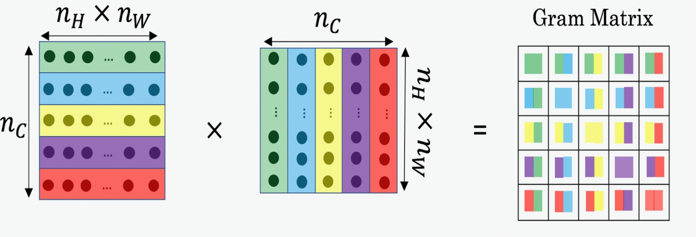

# 神经风格迁移和人脸识别

## 1  摘要
主要讲两种CNN的应用，图片风格化处理和人脸识别。应用层面，对于神经网络的使用远比我想象的灵活，尤其是输出层、损失函数的设计。

神经风格迁移使用的是现有VGG网络浅层构造的模型，人脸识别使用的是GoogleNets。都可以说是迁移学习，只不过，可惜的是没能做迁移学习输出层设计部分。

- Neural style transfer 神经风格迁移
- Face recognition 人脸识别

## 2  神经风格迁移
其实就是前段时间很火的应用，将一张图片的风格融合进另一张图片里。

### 2.1  思想
说起来也简单。
<div align=center></div>
上述为损失函数的设计。

是这样，有三张图片，G为要生成的图片，G等于C图片的内容加上S图片风格。

上述公式，表示最终损失J为，内容相似度损失加上风格相似度损失，优化目标是使得二者尽可能小。换句话说，要使得G最终既像C，风格上又像S。、

那么，问题是:

> 如何量化内容相似度和风格相似度？

### 2.2  利用浅层特征
要回答上述问题，首先得找到图片的基本特征，比如，颜色、轮廓、纹理等等。

这就要先回忆一下神经网络的特点——每一层激活单元最终都代表一种自动抽取出来的特征，浅层处可能都是一些非常简单的边缘、纹理等，深层可能就是轮廓之类。

所以，对于这个问题，我们显然需要利用到浅层部分的特征，对这些特征计算其相似性。

### 2.3  量化内容相似度
如何描述内容的相似度？
<div align=center></div>
简单粗暴的使用类似方差来描述即可。上述公式，对C和G图片的浅层激活值求方差，以求得二者内容上的特征相似度。

### 2.4  量化风格相似度
量化风格这件事比较麻烦。风格本身是一个比较虚的东西，比较难用严格的定义描述。

思路是这样。考虑到浅层中的某一层有n个特征，如何从特征表示出风格信息？我们可以想象，一种画的风格就是由多种特征组合形成的，比如梵高的画中，可能喜欢用某种纹理加上某些色调。于是，我们可以先求出n个特征之间两两的内积，以此来描述两个特征同时出现这件事。关于内积为什么能表示两两同时出现，其实，按我的理解，只是以某种形式同时保存了两种特征罢了。



上图即求所有特征的内积的矩阵运算形式。注意，比如最左处，每一层都是一个filter展开。使用矩阵乘法AA’的结果是，A中每行都会和A’中每列求内积——也就是每个filter（每个特征）都会和其他所有filter求内积。最终得到Gram Matrix，用于量化每两个特征同时出现这件事。

对G图和S图都使用这样的方式得到两个Gram Matrix，相当于我们知道了两张图片之间两两特征同时出现的量的矩阵，可以视为两个图片的风格信息。接下来，要求风格之间的相似度就非常简单了，同理，使用类似方差的的方式。
<div align=center></div>
### 2.5  练习总结
1. 读取vgg的模型，使用它浅层构造新的模型
2. 运行模型

````python
for iter:
    对J优化（向后传播）
    where J优化绑定了：
    	输入图片C,G，跑一次模型得到某层的特征，计算J_C
        输入图片S,G，跑浅层模型得到各层的特征，计算各层 GramMatrix，计算J_S
 
````

## 3  人脸识别
### 3.1  One-shot Learning
人脸识别这件事和过往的目标检测，物体识别这件事不太一样。按道理说，我们要使得一个模型认识tom，需要给模型喂养tom的各种图片，从而使得模型能够正确地将tom归为某个分类。

但这在实际应用是很不方便的，加入你要识别一群人，那么你就得为每个人拍几万张图片，来训练一个多分类的模型。这种思路显然有问题。所以这里提出了另一种情况：识别一群人，每个人仅仅提供一张或少数几张图片，如何识别每一个人？

区别于softmax的多分类模型，这种叫做One-shot learning。通常应用于拥有识别对象群体的完备数据库，做辨认和识别。

### 3.2  思想
人脸识别的朴素思想很简单，就是将这群人的照片都量化层一个128维的vector，存入数据库，而匹配过程其实就是计算拍摄图片的vector和数据库中的vector的相似度，再一次，使用类似方差来计算，不过这里用的是L2 norm，原理一致。

辨认和识别，这也是人脸识别的两个任务。前者是，提供姓名，拍摄该人图片，判断是否此姓名和这个人匹配。后者是拍摄某人图片，判断这个人是谁。识别任务看起来像多分类问题，其实并不是，而是使用拍摄图片对数据库中所有人进行匹配，找出匹配最佳的结果。

### 3.3  损失函数Triplet Loss设计
上述朴素的思想听起来很简单，但是如何设计损失函数来训练网络呢？

公式如下：
<div align=center></div>
上述A为Anchor，指的是要判断的拍摄图片的vector。P表示Positive，指的是该人存在数据库的正确图片的vector。N表示Negative，表示不是该人的图片的vector。

整个公式其实就是说，让检测的人和他自己其他图片要尽可能相似，并且让他与别人图片尽可能不同。公式前一部分，即描述他和他其他图片的相似度误差，后面部分表示他和其他人图片的相似度误差。

从公式来看，要使得J最小，我们必须使得前面部分尽可能小，后面部分尽可能地大。这也就是后面部分使用负号的原因。

另外，为了防止J向负无穷大优化，最后还得使用max（J，0）.

###练习总结

练习使用GoogleNets的模型，即上次学到的Inception。

1. 加载模型，并且为模型导入训练好的权重。多说一句，因为上述损失函数其实需要G,S,C三个图片都跑一遍模型得到三个vector，再计算损失。所以想象训练的过程应该是使用大量的这种Triplet Tuple进行训练。
2. 将目标人群的n个人的图片，分别跑一次模型，量化成n个vector，存入database中
3. 检测。拍摄申请人图片，将其量化成vector，与database中的vector进行match，求出最高match的目标。