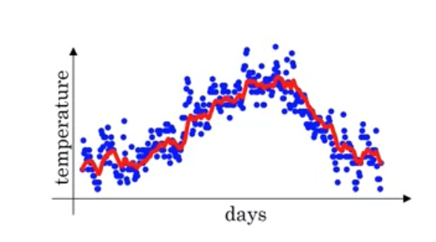
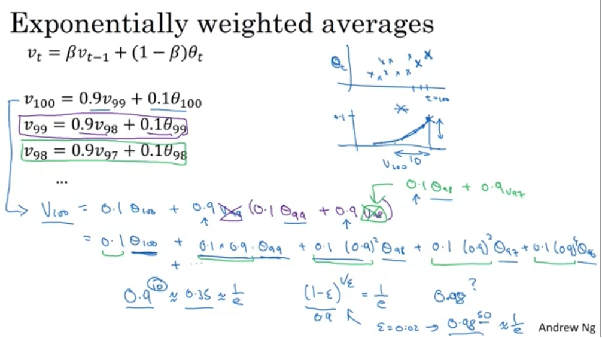
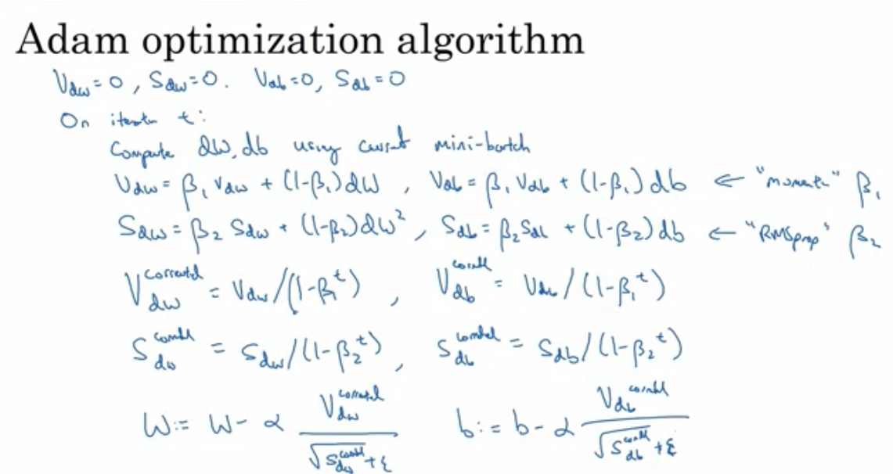
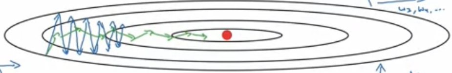
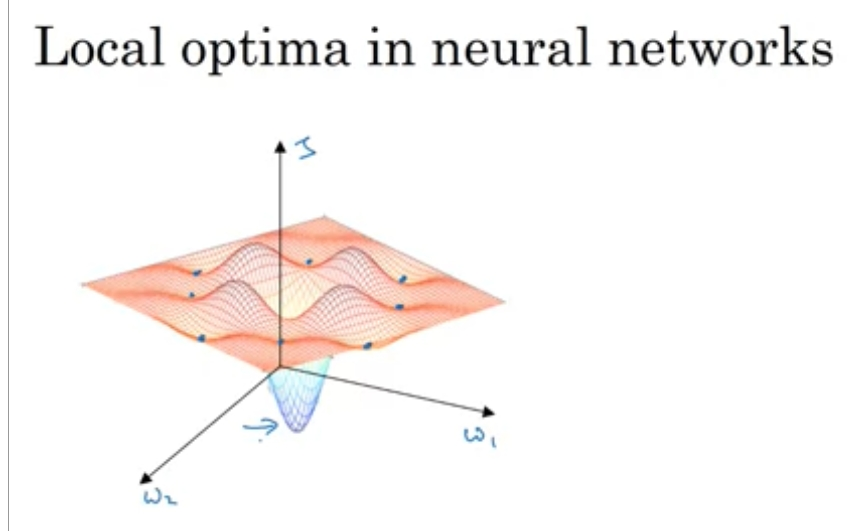

# 优化，Adam optimization

## 1  摘要
本周主要讲大量数据的优化方法。

从方法来看：

- Min-batch，分批随机梯度下降
- Momentum，连续均值梯度下降
- Adam，min-batch（批量） + Momentum（均值） + RMSprop（标准化）

从逻辑上来看：

由于数据量太大，所以采用分批梯度下降，这就是min-batch。而分批梯度下降会带来震荡的问题，因为这是局部最优，所以是使用Momentum求偏导方向均值，使用RMSprop减少不同方向的差异，最终得到了Adam方法。

Adam方法，可以进行分批梯度下降，节省内存；并且它不容易震荡，收敛快。

## 2  Min-batch，分批梯度下降
分批进行的原因很简单，想象一下。我们使用矩阵运算的时候，梯度下降做了什么？将所有层次向前传播得到权重，向后传播得到的梯度，放进内存，每一次进行一层进行运算，注意，这里是所有数据m！所以内存不够很正常。所以就有了分批梯度下降。

这里可能有点容易误解，平常我们进行梯度下降的时候，一层里的所有数据都是**同时**进行计算的，而这里，我们分批之后，是直接走完向前传播和向后传播。

想象一下，这其实拿一部分特征判断偏导方向，直接走。如果每一批个数为1，那就是严格意义上的随机梯度下降——本质上，Min-batch就是随机梯度下降的方法。或者，形象点说，局部求梯度。

## 3  Momentum，连续均值替代瞬时值
### 3.1  原理
利用左右某区间内的连续均值来代替瞬时值，可以使得曲线更加平缓，这是很自然。Momentum就是做的这件事，每次梯度下降的对象不再是瞬时的梯度，而是维护了前几轮到现在梯度下降的和。

所以，先不管它如何求均值的（一般而言，很容易想到，存几个状态的数据，求下平均），它原理非常简单，就是连续均值代替离散瞬时值。

可以看到，红线相对于原来的数据已经“平滑”很多。

### 3.2  Exponentially weight averages
把连续数据存放内存求均值？太消耗内存，而且计算量很大，要知道，数据量本来就很大，连续存放10份，20份？这不太可能。

所以Exponentially weight averages是一种数学技巧，估算均值用的。它不需要很多内存，这就是关键。

**原理**

利用v来代替θ，θ在这里就是权重，我们记为w，β是一个超参数，一般很容易设定。数学上可以证明，它大致估算的的是1/(1-β)项的均值。

**为什么这种东西能估算均值？**

从后往前展开，可以发现展开式子非常规律。

系数是等比数列，求和等于1，这可以想象为权重和为1的关于前几项θ的加权和。如果β比较大的话，基本可以视为n项的加权均值。

**实现**

原理比较繁琐，但不复杂，实现就非常简单了。所以才这么被广泛使用，参考公式一，不需要保存多个数据状态。

最后一行就是梯度下降了，可以看到，就是讲瞬时梯度换成均值而已。

## 4  Adam，分批均值标准化结合
### 4.1  简介
Adam是将分批，和连续均值结合起来的算法。只不过，它还引入了一种对梯度标准化的方法，就是RMPprop，这个类似于我们对输入数据的标准化，目的是让特征（偏导数）之间不要差距太大。

### 4.2  RMPprop
为了讲清楚Adam，必须先讲下两个东西，RMPprop和偏差调整。就如上面所述，RMPprop是一种对偏导数进行标准化的算法，很简单。

看起来复杂，其实不要关注公式，有没有发现这个公式其实主要复杂都是在求均值——和公式（3）基本一样。

> 只需关注它求了dw的平方的和的均值，然后最后用的时候，还除掉了它的开方。——这不正是标准化化吗？

###4.3  偏差调整

因为Exponentially weight averages这个求均值的方式是从V0=0开始的，所以前面并不等于均值，有时候我们会想修复这个偏差。其实不修复，迭代一定次数之后就会正常。

修复其实很简单，上述公式，t是min-batch迭代次数。当t很低时，V会变大——修复前面太小，当t很高时，基本就等于V本身。

### 4.4  原理
有了上述方法，最终我们得到了一个“终极的解决方案”

就是把所有公式都堆叠在一起。

由于Min-batch，它可以分批进行。

由于Momentum，它可以利用均值使得梯度下降变得更加平滑，震荡小得多。

由于RMPprop，再次使得各个方向的梯度差异变小，减少震荡。

这个东西，直观上的优化如图。

垂直方向和水平方向可以视为两个不同方向的dw（梯度），绿线是优化之后的方法。

## 5  其他优化方法
下面是提到的一些不是特别显著的优化方法。

### 5.1  local optimal

这图太好了，可以概括这个原理，简单来说，就是只看局部的w，对J进行优化，如上图。

### 5.2  Learning rate decay
学习率α不断衰减，为什么要这样，原因是太大的学习率到了快要收敛的时候会在邻域内来回波动，这个非常非常耗时，所以这个方法有助于缓解这种现象。

