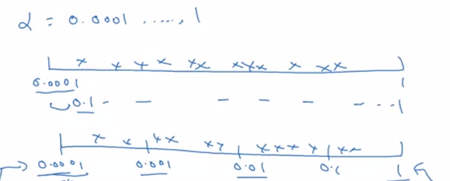
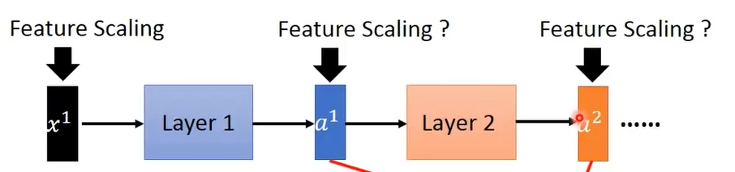
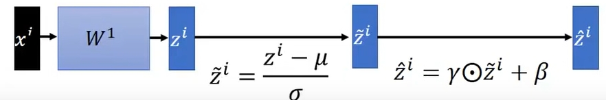

# 调参优化理论与TensorFlow使用

## 1  摘要
调参优化理论接近尾声，这周讲得主要是调参在实践中的顺序，范围，然后比较重要的部分，Batch Normalization——对每层输出进行标准化的算法，以及多分类激活函数softmax。

然后练习就是开始使用tensorflow，比想象的要容易上手，AN这门课的作业设计太过用心。

## 2  调参in实践
### 2.1  顺序
通常而言，不同参数调参的重要性是不同的。

>α ->  β、hident unit、min-batch size -> layer、learning rate -> β1、β2、ε

### 2.2  Scale，合适的尺度
一般调参都使用随机取点，这是区别于各参数之间均匀取点，之所以如此，是因为各个参数均匀取点，相当于各个参数调节次数一样，但是，参数之间重要程度完全不同，所以这个方法不合理。

调参需要选择合适的尺度，同样，均匀区间并不可取。如下图，假设范围是0.0001到1，我们很正常的想法是，直接数轴上调节。这样很不好，原因是每个区间对结果影响并不一样，比如从0.1到1基本没影响，从0.0001到0.1却是重点区间。

所以方法是，在指数意义上进行调节。其实很简单，以10为底，则0.0001是10的-4次方，1是10的0次方，然后调节-4到0随机值。如数轴二。

## 3  Batch Normalization算法
### 3.1  概述
这个其实思想非常简单，是一种标准化的算法，我们都知道标准化在梯度下降时是非常重要的，所以这个就是对每一层输出进行标准化的一种方法。

### 3.2  原理

前面两条公式是求均值和方差，第三条公式对每一层的Z进行标准化，在数学上，这种标准化的结果是使得mean = 0，variance = 1，即统计意义上是固定的。最后的公式是因为，我们一方面想让所有输出都大致在一个范围，又想防止它落在激活函数的“不好的部分”，比如线性部分或者平坦部分，所以第四公式对结果再进行偏移。

这是我们计算的过程。

具体分析比较多，放在分析中。

### 3.3  为什么有用？为什么能加速？
讨论这个问题之前，先得理解一个现象。

**Internal Covariate Shif**

大概翻译是内部变量的协同变化，什么意思？理解这个很关键，比如说A > B，我们要使他们相同，那么策略就是A降低，B升高，但如果同时发生，就可能出现一种情况，B < A——在让他们相等的意义上，我们等于什么都没做。这就是协同变化。想象一下，神经网络那么深，每一层都影响后面一层，而且前面的层次在不停变化，那么协同变化现象应该非常严重。

**所以为什么BN算法能有效？**

> 1. 标准化使得每个输出的范围都尽可能相同。

这是标准的共同优点

> 2. 减少前面层次对后面层次的影响

如上分析，协同变化现象很影响深度神经网络的性能。关键在于前面层的变化对于后面层来说是不确定的。而经过标准化后，前面层次的输出一方面是范围差不多，另一方面，如原理中所说，标准化后获得一种统计意义上的固定。这是最重要的一条。

> 3. 有一些正则化的效果

和dropout算法一样，简单来说就是全局性压制了权重的值，但具体为什么，课程中说是在每一层引入了噪声，但我不是很懂，应该是信息论的相关知识。

### 3.4  测试时的处理
因为测试时只有一组数据，我们无法计算均值和方差，所以一般是利用训练集的均值来代替。这是一个重要的细节问题。

### 3.5  遗留问题
1. 数理统计，为什么标准化后mean = 0，variance =1？
2. 信息论，关于有轻微正则化的效果，噪声理论解释，如何理解？
3. 上面忽略了一个重要的问题，反向传播怎么计算？

AN的意思是，讲解BN算法，重点在于理解原理，一般不用自己实现，框架中反向传播是自动的，我们只需理解算法，方便以后的使用。

## 4  多分类激活函数Softmax
### 4.1  原理
比较简单，一种多分类的算法，相较于sigmoid的二分类功能。这是最常用的输出激活函数。

很简单，每一个除以总体求概率，至于为什么要以e为底，想一下，有什么办法可以在求和的时候去掉负值的影响？就是以e为底嘛，而且e^x这个函数是严格单调递增，不会改变原来x的大小问题。

## 5  TensorFlow概述
练习是用tensorflow做一个手比数字的识别，特点是数据量很大，12288个特征 * 1080张图片。

1. tensorflow对数学方程这件事进行了非常严格的封装，就像在java中一样，但是google不叫类，它定义其为图，于是我们的主要任务是，定义一张运算图，并运行它。图包括各种节点（变量），各种运算。
2. 使用的过程用到了变量的不同形式，X，Y，模型搭建时没有数据，所以用占位符设置，需要指定名字，因为运算的时候需要以字典的形式喂之数据。权重W，函数J，这种会一直变的，tf中定义为Variance。
3. 图定义完都需要经过会话运算才能真正执行，包括变量获取。
4. tensorflow搭建神经网络模型的时候，只需要关注向前传播，以及损失函数定义，向后传播，它会帮你做，帮你求导，所以总体上用起来是简单很多的。

