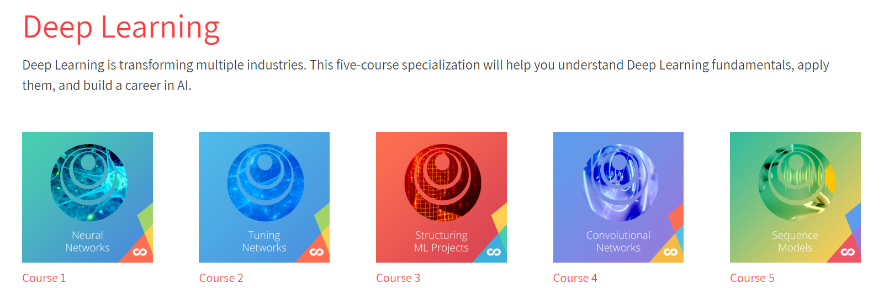

# Cousera深度学习系列课程笔记

## 说明

Coursera上面的著名深度学习系列课程的学习笔记，以及实现。按coursera的荣誉准则，这里不提供实现代码。不过确实在本地调试会方便很多，比起jupyer notebook。所以提供了基本所有课程用到的数据。大部分是爬下来的，但是后期有些数据集和模型太大，不过也找了很久找齐了。

另外，github上的公式显示问题已经用脚本和库转为图片了，大是还有小部分不能正常显示，下载本地即可正常阅读。

**提醒：**

- 课程4最后一周的迁移风格，建议线上做，线下做bug修起来比较麻烦。
- 同样最后一周，人脸识别中weights文件夹中的数据需要解压到当前目录一下，太多了，所以打了个包。有些模型太大我就打了包，注意解压一下。
- course 5的代码中间被我一顿git的瞎操作丢了，重新在网上借用了别人的版本，只恢复了笔记。

**使用的平台：**

- python
- vscode

## Course 1 - Neural Networks And DeepLearning
> - [Week1&Week2 - 深度学习入门](NeuralNetworksAndDeepLearning/notes/Week1&Week2.md)
> - [Week3 - 浅层神经网络](NeuralNetworksAndDeepLearning/notes/Week3.md)
> - [Week4 - 深层神经网络](NeuralNetworksAndDeepLearning/notes/Week4.md)

## Course 2 - Structuring MachineLearning Projects
> - [Week8 - 实践一](StructuringMachineLearningProjects/notes/Week8.md)
> - [Week9 - 实践二](StructuringMachineLearningProjects/notes/Week9.md)

## Course 3 - ImprovingDeep NeuralNetworks Hyperparameter Tuning Regularization And Optimization
> - [Week5 - 正则化 & 初始化 & 标准化 & 对拍Debug](ImprovingDeepNeuralNetworksHyperparameterTuningRegularizationAndOptimization/notes/Week5.md)
> - [Week6 - 优化，Adam optimization](ImprovingDeepNeuralNetworksHyperparameterTuningRegularizationAndOptimization/notes/Week6.md)
> - [Week7 - 调参优化理论与TensorFlow使用](ImprovingDeepNeuralNetworksHyperparameterTuningRegularizationAndOptimization/notes/Week7.md)

## Course 4 - Convolutional Neural Networks
> - [Week10 - 卷积神经网络](ConvolutionalNeuralNetworks/notes/week10.md)
> - [Week11 - 高级卷积神经网路](ConvolutionalNeuralNetworks/notes/week11.md)
> - [Week12 - 用于目标检测的YOLO和R-CNN](ConvolutionalNeuralNetworks/notes/week12.md)
> - [Week13 - 神经风格迁移和人脸识别](ConvolutionalNeuralNetworks/notes/week13.md)

## Course 5 - SequenceModels
> - [Week14 - RNN & LSTM](SequenceModels/notes/week14.md)
> - [Week15 - Word Embeddings&文本情感分析](SequenceModels/notes/week15.md)
> - [Week16 - RNN进阶以及Attention模型](SequenceModels/notes/week16.md)

## Reference

https://www.coursera.org/specializations/deep-learning?

