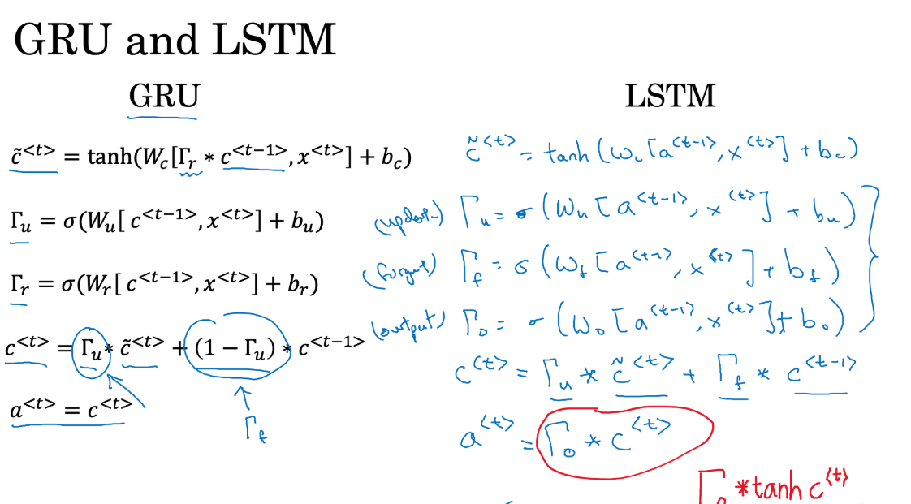

# RNN & LSTM

## 1  摘要
从上次以来，确定方向，听讲座……发生了太多事，断断续续才看完了，老师说的还是没有错，脱离项目是不行的，学了忘没什么意义。

本文主要就是RNN和LSTM，形式很复杂，但思想很简单。

- RNN
- LSTM
- GRU

## 2  原理
### 2.1  Intuition
我们考虑一件事，如何描述、量化一句话中每个词之间的关系？我们来看CNN怎么做，CNN通过卷积来压缩每个特征（从象数点到高级特征）。但是句子、序列怎么办？

RNN实际上一种量化这种序列之间关系的模型，从这个角度看，CNN可以视为刻画空间上的特征关系，RNN则对应地看作刻画时间序列的特征关系。

### 2.2  RNN基本思想

上图是RNN的简单基础模型，实际上，理解RNN的运行过程相当重要。上图有个缺点，看起来像一个横向的结构，其实并不是，它是单个结构的输出和输入的循环展开。中间绿色层的输出会作为下一次的输入。真实的模型大概类似下方。

重点在于，“过去的词都有了关联” = 量化了序列单位之间的关系。

## 3  RNN&GRU&LSTM
上述思想就是RNN的基本架构，至于每一次垂直的层次可能很复杂，但基本上，就是不同的cell单元，下面是RNN & GRU & LSTM的最简单形式。

### 3.1  RNN cell
RNN cell很简单，没什么好说的。需要注意的是，从a的形式可以明显看出，多次循环之后，W会是指数幂的形式，于是，会形成梯度弥散的严重问题。

### 3.2  LSTM
LSTM是为了解决梯度弥散的问题而出现的，思想其实也是很简单的，但是形式非常复杂。我们先来了解Gate。

**Gate**

上图，给最简单的RNN cell中加入三个门，功能分别是，关闭输入，关闭输出，忘记当前值（保留上一层次的C值）。这三个门的功能，我感觉可以类比残差网络里的捷径——即提供了某种机制，跳过一些层次操作。这三个门在直观上，提供了这样的可能：输入门，目标句子和当前词（x）可能无关；忘记门，目标句子可能和以前的词有关；输出门，目标句子和当前以及以前的句子都无关。

**LSTM**

上图是LSTM的基本单元，看起来很复杂，事实上，把重点放在红框第二条第三条公式，忘记门和更新门（输入门），输出门提供了开关，最终计算出a值。其他三个门里的公式，其实形式是固定的，开始学习的时候，不要对它有压力。

**GRU**

GRU是LSTM的简化版本，其实可以看成，取消了输出门。实践证明，这也是同样有用的。

### 3.3  为什么能解决梯度弥散的问题？
试着回答这个问题。考虑到梯度弥散问题，本质上是因为前面的序列中不断乘上W，这件事使得梯度会指数级别增加或减少。但是加入门之后，提供了这样的可能——一定概率上可以取消或减缓前面的影响。

从公式上看。

比如图中输入门可能趋近0，则c值并不会变得特别小，而是会基本和前面的c相等。

## 4  反向传播推导
RNN的反向传播的推导，看起来非常非常复杂，但其实基本是线性函数，所以只是写起来麻烦，并不难看懂。来看看RNN。

反向传播如下：

需要注意的是，我不知道这件事怎么说清楚，如果做过实现的就应该知道。下面的公式是每个层次之间梯度的关联。

LSTM原理非常类似，但会比较难看懂。

## 5  练习
- 一步一步搭建RNN，包括LSTM
- 恐龙的名字和莎士比亚的诗
- 爵士乐生成

