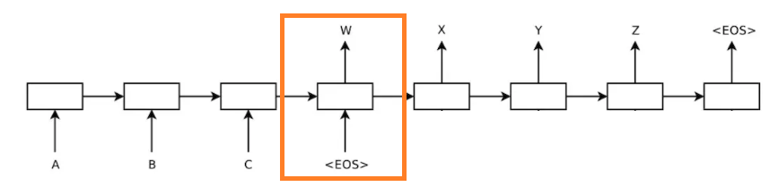
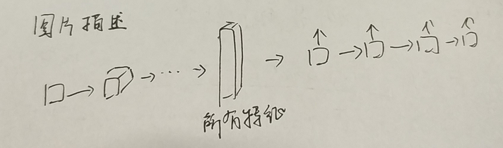
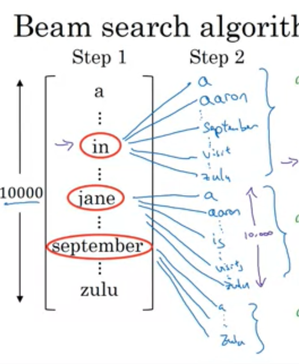
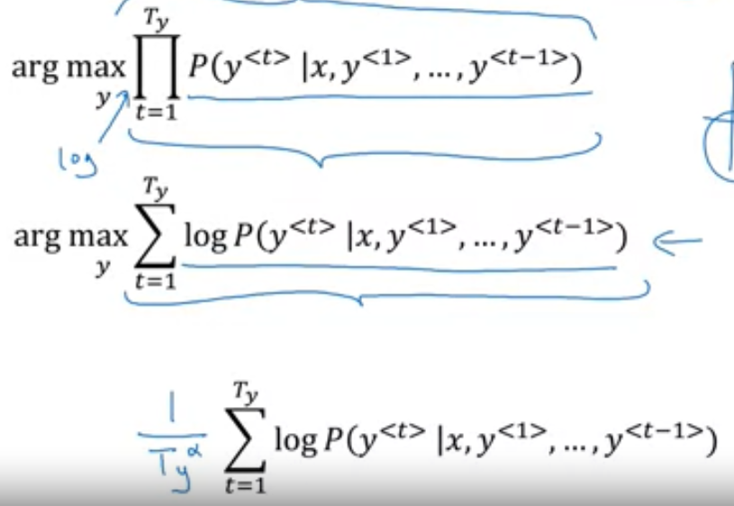
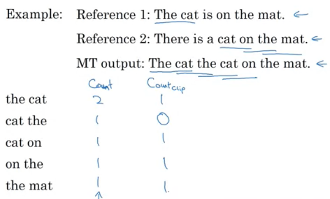
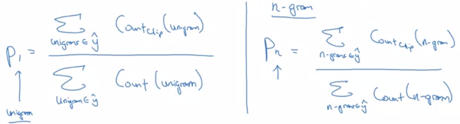
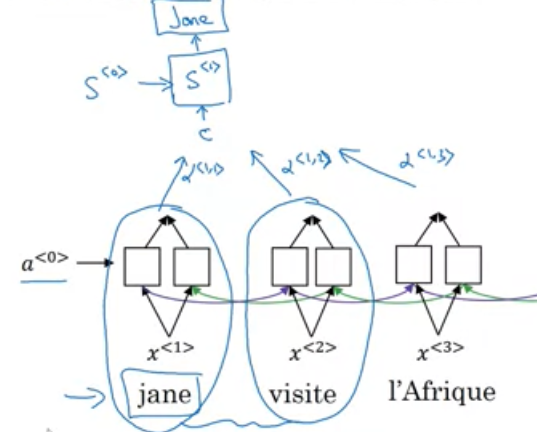

# RNN进阶以及Attention模型

## 摘要

不管是CNN和RNN，模型都可以看作是Decode和Encode两个过程，这是一个统一的角度。其次，介绍了RNN中的搜索算法Beam Search方法，以及它的优化和分析。关于如何评定翻译好坏，怎么给翻译的好坏设计监督方式，介绍了Bleu Score的方法。最后，介绍了Attention模型。

- Decode-Encode
- Beam Search
- Bleu Score
- Attention Model

## 从Decode-Encode角度审视模型

### sequence-to-sequence和image capture

上图是典型的RNN模型，红框中的Cell，可以视为对序列进行解码，cell中保存了序列的所有信息。其实在CNN中，最后的卷积层中，同样包含了图片的所有信息。

这里有一个非常重要的idea。

> 不管是什么模型，做的事只有一件，对目标进行解码，抽取出所有特征。

我们再来看Image Capture模型。

最终的卷积层包含了所有特征，而输出，取决于我们如何设计监督函数，或者说，如何对特征进行编码。

## Beam Search

这是一个在机器翻译背景下提出的概念。在机器翻译过程中，每个time step选择概率最大的词并不一定是最好的翻译。这很好理解。每次选择最大的，其实是贪婪算法，贪婪的结果不一定是最优，尤其是在长句翻译的时候，句子越长，贪婪算法出现的问题越大。

直观的解决方法是，找到所有组合，找出一个组合，这个组合的整体概率最大。但这件事的效率太低了。所以Beam Search实际上是上述方法的简化版本，每次都选择前B个概率最大的词，而不是全部可能性。

### 优化

概率连乘，连乘的老问题，类似梯度爆炸。这里的解决办法非常简单，加上log就完了。

第二个优化是归一化。见最后一条公式。

### 错误分析

使用Beam Search之后会出现一个问题，当人类翻译和模型输出表现不一致时，如何确定是BS的问题还是RNN的问题。

> $$
> P\left(y^{*} | x\right)>P(\hat{y} | x)
> $$
>
> y_star是是人类表现，y_hat是模型输出。因为BS的目的就是，提高最终结果的概率，所以当人类翻译大于机器翻译的概率时，表示BS出问题，应该加大B的值。
> $$
> P\left(y^{*}(x) \leqslant P(\hat{y}(x)\right.
> $$
> 反过来，机器翻译的概率比人类翻译的概率更高，假设人类翻译是更好的翻译，那么现在的问题一个归咎于RNN模型本身。

## Bleu Score

延续这个模型，机器翻译的结果如何评定。

上图就是Bleu Score的基本计算方法，以2个词为一个ngram，左侧是机器翻译中出现的次数，右侧是参考翻译中的出现次数（取二者的最高值）。

最终的计算公式如下。

其实这个很简单吧。这里的主要关注点应该是如何将一个问题变成单一评价标准。

## Attention Model

注意力机制，这是非常重要的一个新算法。实现方面还是遗留了很多问题，待后面了解。

还是从机器翻译讲起。人类不可能看完一整段文字再做翻译，但是上面的RNN正是这样的，整个句子输入之后，抽取了所有特征才输出翻译。所以长句子翻译准确性会迅速降低。

注意力机制就是为了解决这个问题——只想要根据某一段来进行翻译，而不是一整句。

所以，Attention机制的解决方式非常简单，给每一个time step的输出加一个权重，使得机器可以对其进行训练，这个可以视为一个滑动窗口。

注意力机制，应该也是参考了人类局部感知的能力。我觉得这个会很有用，可能在cnn中也很有用。

## **练习**

**机器翻译，日期转化**

这个实验做得我很懵，attention机制的实现还是麻烦。

**语音触发**

Keras模型搭建够简单了，所以重点在于数据的预处理。

使用傅里叶变换，将语音数据变为频谱。将目标语音合成到背景环境中，过程中需要注意不要重叠，以及label如何标注（50个连续点）

