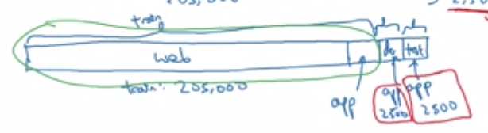

# 实践二

## 1  摘要
本周仍然是构建模型过程中遇到问题的处理、分析方法。

包括可以指明方向的错误分析，训练集与dev/test集分布不同的常态的处理，以及机器学习模型的基本结构。

- Error Analysis 错误分析，清洗标签
- 数据集分布不同
- Transfer learning迁移学习、多任务学习
- end-to-end 端到端学习

## 2  错误分析
错误分析是指对dev/test集中，预测错误数据进行人工分析，大概是下面的这种表。

| 错误数据编号 | 类别1 | 类别2 | ….   |
| ------------ | ----- | ----- | ---- |
| 11           | T     |       |      |
| …            |       |       | T    |
| 比率         | …     | …     |      |

好处是，可以找到，模型出错的原因，分别都是什么引起的。最好的地方，可以知道这些方向的优化空间，优化优先级。这是个非常非常有用的事，因为，可能只需要短短几周时间分析数据，就可以确定优化方向、分工，能为团队节省大量的时间。——尽管这个过程非常无趣。

**清洗标签**

这个指的是，有一部分错误是标签本身打错导致的。那怎么办呢，该不该修正？

通常策略是这样的。

1. 从错误分析中，确定标签错误的优化空间，确定是否值得花时间
2. 一般只修正错误标签，一般只修正dev/test set，训练集因为太大了

## 3  训练集和dev/test集分布不同
这件事是一个常态，而且非常麻烦。原因是，模型通常对数据量非常饥渴，但是特定领域的数据通常不够用。很多时候，都会在训练集中尽可能塞下不是非常严格的领域数据集，数据量大当然是正确的。但这带来一个问题，训练用的数据和最终目标要预测的数据不太一样，或者说分布不同。

以下面为例，测试的是一般图片，最终确是要在移动端的图片。移动端的数据集很小，如何引入？

### 3.1  引入新目标数据集
是这样的，我们要尽可能保证dev和test中的分布相同，所以，一般要重点关注这一部分，对于上述例子，一般是将移动端的数据集切半，一半加入训练集一半加入后面两个。

上图，移动端数据为10000，对半切分。

### 3.2  trian dev set
如此引入数据后会出现新的问题。假设最终结果显示，训练集和dev/test集的误差相差非常大。现在的两类数据集的区别有两个，一是前面的数据被模型跑过，后者没有，二是后者引入了全新的数据。所以两个这时有两个可能，一是两种出现了训练数据过拟合，二是新数据不匹配。

这时我们无法确定，究竟是哪一种出现了问题。于是，很自然的，我们引入了新的dev集，trian dev set，由于区分这种情况。

### 3.3  新的模型分析理论
| 出误差的数据集 | 误差类型   | 分析                                               |
| -------------- | ---------- | -------------------------------------------------- |
| human-level    | 贝叶斯误差 | 天花板，无法处理..                                 |
| train set      | bias       | 训练不够，大网络，时间，优化..                     |
| train dev set  | variance   | 方差太大，train set过拟合，正则化、增大train set.. |
| dev set        | mis-match  | 分布不同导致失配，见下面分析                       |
| test set       | variance   | dev set过拟合，增大dev                             |

## 4  mis-match处理
失配怎么办？这变成了现在常态下的大问题。一般没什么系统性的解决办法。但是有一些经验，一般思想是：

> 尽量让train set中的数据与目标数据贴合

**在训练集中增加目标数据**

比如你发现dev错误分析中，很多错误是镜头被大雾影响，那么最简单的方法就是往训练集中增加大雾天气的数据。重新收集是一个办法，大部分还是人工合成方便很多，但是人工合成要防止过拟合——合成情况要足够多。

## 5  迁移学习和多任务学习
再一次，特定领域的数据通常是不够的。所以一般用的比较多的是迁移学习和多任务学习。基本原理都是这样的：

> 相似数据集中某些特征其实是一样的。

比如说，要识别黄灯，但是只有绿灯和红灯的图片数据量够大，那么可以使用迁移学习或者多任务学习——其中很多特征一样，比如灯的轮廓，边缘。当然，神经网络是一个黑箱，很难真的找出相关特征。

多任务学习也是这样的，其实也就是多分类问题。比如猫和狗有很多特征是一样的，所以一起训练可能结果会比单独训练要好。这其实也说明神经网络和逻辑回归的区别之一，大量计算是共享的，所以快很多。

## 6  端到端学习&分阶段学习
深度神经网络类似于黑箱——你很多时候只知道输入和输出，过程并不清楚。所以会有这个端到端的名字。但这里有更特定的含义。这个举个例子就很清楚了。

比如做行人检测，有两个思路：

1. 输入大量的图片和标签，通过神经网络训练，直接得到x-->y。
2. 分阶段，先定位，检测出人在哪些地方，然后才识别。

很好理解吧，第一种就是端到端，输入到结果，第二种是分阶段。

